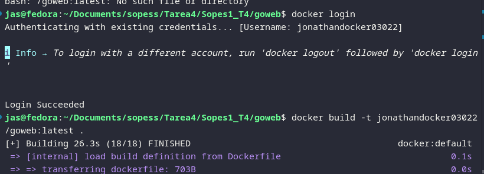
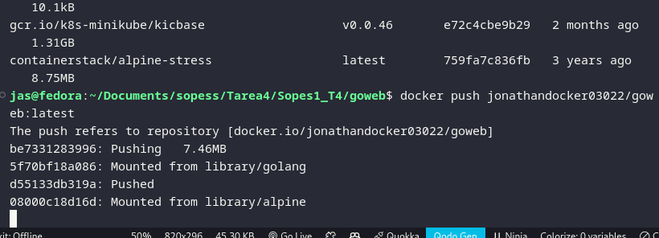
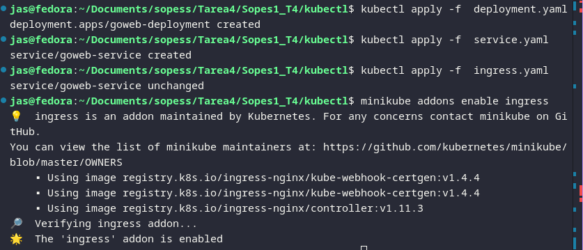
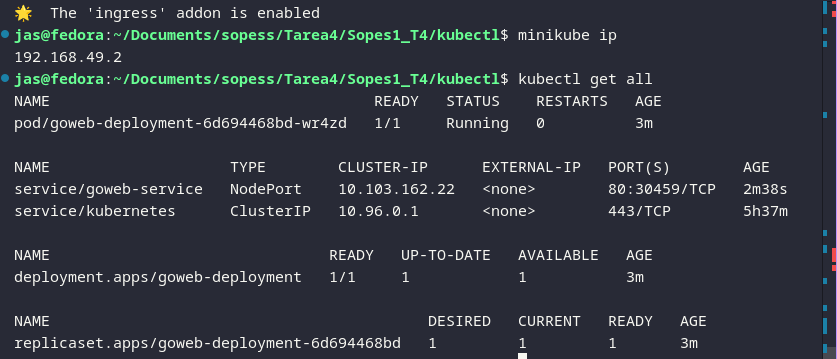
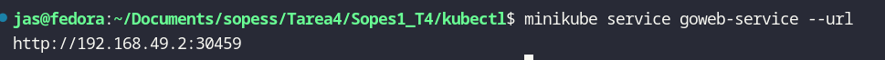
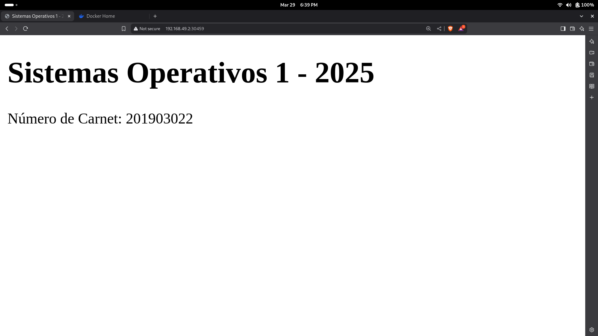

# Sopes1_T4 - Kubernetes Test on Fedora 41

## 📌 About

This project demonstrates how to set up a local Kubernetes cluster using **Minikube** and **kubectl** on **Fedora 41**, and deploy a simple Go web application.

---

## 📅 Environment
- OS: Fedora 41
- Kubernetes: v1.32.0 via Minikube
- kubectl: v1.29.2
- Docker used as Minikube driver

---

## 📅 Install `kubectl` locally

1. Download the binary:
```bash
https://dl.k8s.io/release/v1.29.2/bin/linux/amd64/kubectl
```
2. Make it executable and move it:
```bash
chmod +x kubectl
sudo mv kubectl /usr/local/bin/
```
3. Verify the installation:
```bash
kubectl version --client
```

---

## 📦 Install Minikube locally

1. Download Minikube:
```bash
curl -LO https://storage.googleapis.com/minikube/releases/latest/minikube-linux-amd64
```
2. Make it executable and move it:
```bash
chmod +x minikube-linux-amd64
sudo mv minikube-linux-amd64 /usr/local/bin/minikube
```
3. Verify the installation:
```bash
minikube version
```

---

## 🚀 Start Minikube

Check Minikube status:
```bash
minikube status
```

Start with Docker driver:
```bash
minikube start --driver=docker
```

Or default:
```bash
minikube start
```

Verify Kubernetes is up:
```bash
kubectl get nodes
```

Expected output:
```
NAME       STATUS   ROLES           AGE   VERSION
minikube   Ready    control-plane   ...   v1.32.0
```

---

## 📂 Project Files

### `main.go` (Go server code)
```go
package main

import (
	"fmt"
	"net/http"
)

func handler(w http.ResponseWriter, r *http.Request) {
	carnet := "201903022"
	mensaje := fmt.Sprintf(`
		<!DOCTYPE html>
		<html>
		<head><title>Sistemas Operativos 1 - 2025</title></head>
		<body>
		<h1>Sistemas Operativos 1 - 2025</h1>
		<p>Numero de Carnet: %s</p>
		</body>
		</html>
	`, carnet)
	fmt.Fprint(w, mensaje)
}

func main() {
	http.HandleFunc("/", handler)
	fmt.Println("Server listening on port 8080")
	http.ListenAndServe(":8080", nil)
}
```

### `Dockerfile`
```Dockerfile
FROM golang:1.23-alpine AS builder
WORKDIR /app
COPY . .
RUN go build -o goweb

FROM alpine:latest
RUN apk --no-cache add ca-certificates
WORKDIR /root/
COPY --from=builder /app/goweb .
EXPOSE 8080
CMD ["./goweb"]
```

### Build and Push Docker Image
```bash
dockeer login
docker build -t your_docker_user/goweb:latest .
docker push your_docker_user/goweb:latest
```


---


---

## 🔧 Kubernetes Manifests

### `deployment.yaml`
```yaml
apiVersion: apps/v1
kind: Deployment
metadata:
  name: goweb-deployment
spec:
  replicas: 1
  selector:
    matchLabels:
      app: goweb
  template:
    metadata:
      labels:
        app: goweb
    spec:
      containers:
        - name: goweb
          image: your_docker_user/goweb:latest
          ports:
            - containerPort: 8080
```

### `service.yaml`
```yaml
apiVersion: v1
kind: Service
metadata:
  name: goweb-service
spec:
  selector:
    app: goweb
  ports:
    - protocol: TCP
      port: 80
      targetPort: 8080
  type: NodePort
```

### `ingress.yaml`
```yaml
apiVersion: networking.k8s.io/v1
kind: Ingress
metadata:
  name: goweb-ingress
spec:
  rules:
    - host: goweb.local
      http:
        paths:
          - path: /
            pathType: Prefix
            backend:
              service:
                name: goweb-service
                port:
                  number: 80
```

---

## 🌐 Enable Ingress

```bash
minikube addons enable ingress
```

Edit `/etc/hosts` to access Ingress route:
```
192.168.49.2 goweb.local
```

Access your app:
```
http://goweb.local
```

---

## 🔍 Useful Commands

```bash
kubectl apply -f deployment.yaml
kubectl apply -f service.yaml
kubectl apply -f ingress.yaml
minikube service goweb-service --url
kubectl get all
minikube ip
```



---

## ✅ Result
A Go web app displaying student ID `201903022` is now deployed and accessible via Kubernetes in Minikube with either:
- `http://goweb.local` (Ingress)
- `http://<minikube-ip>:<NodePort>`

If you ain't addes to /etc/hosts: 

```bash
minikube service goweb-service --url
```
This return your ip address to copy paste on your favorite browser. 



# Result: 
